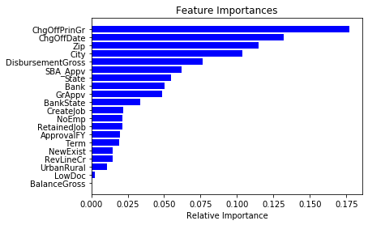
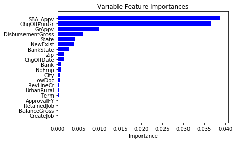
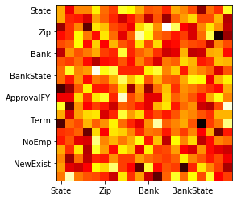

# Calculating feature interactions

```python
import pandas as pd
import sklearn
import numpy as np
from sklearn.model_selection import train_test_split
from sklearn import preprocessing
from sklearn.ensemble import RandomForestClassifier
import matplotlib.pyplot as plt
```


```python
df = pd.read_csv('SBAnational.csv')
df.head()
```


<div>
<style scoped>
    .dataframe tbody tr th:only-of-type {
        vertical-align: middle;
    }

    .dataframe tbody tr th {
        vertical-align: top;
    }

    .dataframe thead th {
        text-align: right;
    }
</style>
<table border="1" class="dataframe">
  <thead>
    <tr style="text-align: right;">
      <th></th>
      <th>LoanNr_ChkDgt</th>
      <th>Name</th>
      <th>City</th>
      <th>State</th>
      <th>Zip</th>
      <th>Bank</th>
      <th>BankState</th>
      <th>NAICS</th>
      <th>ApprovalDate</th>
      <th>ApprovalFY</th>
      <th>...</th>
      <th>RevLineCr</th>
      <th>LowDoc</th>
      <th>ChgOffDate</th>
      <th>DisbursementDate</th>
      <th>DisbursementGross</th>
      <th>BalanceGross</th>
      <th>MIS_Status</th>
      <th>ChgOffPrinGr</th>
      <th>GrAppv</th>
      <th>SBA_Appv</th>
    </tr>
  </thead>
  <tbody>
    <tr>
      <th>0</th>
      <td>1000014003</td>
      <td>ABC HOBBYCRAFT</td>
      <td>EVANSVILLE</td>
      <td>IN</td>
      <td>47711</td>
      <td>FIFTH THIRD BANK</td>
      <td>OH</td>
      <td>451120</td>
      <td>28-Feb-97</td>
      <td>1997</td>
      <td>...</td>
      <td>N</td>
      <td>Y</td>
      <td>NaN</td>
      <td>28-Feb-99</td>
      <td>$60,000.00</td>
      <td>$0.00</td>
      <td>P I F</td>
      <td>$0.00</td>
      <td>$60,000.00</td>
      <td>$48,000.00</td>
    </tr>
    <tr>
      <th>1</th>
      <td>1000024006</td>
      <td>LANDMARK BAR &amp; GRILLE (THE)</td>
      <td>NEW PARIS</td>
      <td>IN</td>
      <td>46526</td>
      <td>1ST SOURCE BANK</td>
      <td>IN</td>
      <td>722410</td>
      <td>28-Feb-97</td>
      <td>1997</td>
      <td>...</td>
      <td>N</td>
      <td>Y</td>
      <td>NaN</td>
      <td>31-May-97</td>
      <td>$40,000.00</td>
      <td>$0.00</td>
      <td>P I F</td>
      <td>$0.00</td>
      <td>$40,000.00</td>
      <td>$32,000.00</td>
    </tr>
    <tr>
      <th>2</th>
      <td>1000034009</td>
      <td>WHITLOCK DDS, TODD M.</td>
      <td>BLOOMINGTON</td>
      <td>IN</td>
      <td>47401</td>
      <td>GRANT COUNTY STATE BANK</td>
      <td>IN</td>
      <td>621210</td>
      <td>28-Feb-97</td>
      <td>1997</td>
      <td>...</td>
      <td>N</td>
      <td>N</td>
      <td>NaN</td>
      <td>31-Dec-97</td>
      <td>$287,000.00</td>
      <td>$0.00</td>
      <td>P I F</td>
      <td>$0.00</td>
      <td>$287,000.00</td>
      <td>$215,250.00</td>
    </tr>
    <tr>
      <th>3</th>
      <td>1000044001</td>
      <td>BIG BUCKS PAWN &amp; JEWELRY, LLC</td>
      <td>BROKEN ARROW</td>
      <td>OK</td>
      <td>74012</td>
      <td>1ST NATL BK &amp; TR CO OF BROKEN</td>
      <td>OK</td>
      <td>0</td>
      <td>28-Feb-97</td>
      <td>1997</td>
      <td>...</td>
      <td>N</td>
      <td>Y</td>
      <td>NaN</td>
      <td>30-Jun-97</td>
      <td>$35,000.00</td>
      <td>$0.00</td>
      <td>P I F</td>
      <td>$0.00</td>
      <td>$35,000.00</td>
      <td>$28,000.00</td>
    </tr>
    <tr>
      <th>4</th>
      <td>1000054004</td>
      <td>ANASTASIA CONFECTIONS, INC.</td>
      <td>ORLANDO</td>
      <td>FL</td>
      <td>32801</td>
      <td>FLORIDA BUS. DEVEL CORP</td>
      <td>FL</td>
      <td>0</td>
      <td>28-Feb-97</td>
      <td>1997</td>
      <td>...</td>
      <td>N</td>
      <td>N</td>
      <td>NaN</td>
      <td>14-May-97</td>
      <td>$229,000.00</td>
      <td>$0.00</td>
      <td>P I F</td>
      <td>$0.00</td>
      <td>$229,000.00</td>
      <td>$229,000.00</td>
    </tr>
  </tbody>
</table>
<p>5 rows × 27 columns</p>
</div>


```python
bad_columns = ['LoanNr_ChkDgt', 'NAICS', 'ApprovalDate', 'DisbursementDate', 'Name', 'FranchiseCode']
target = 'MIS_Status'
categorical = ['City', 'State', 'Zip', 'Bank', 'BankState', 'NewExist', 'UrbanRural', 'RevLineCr', 'LowDoc']
ordinal = ['ApprovalFY', 'Term', 'NoEmp', 'CreateJob', 'RetainedJob']
money_columns = ['DisbursementGross', 'BalanceGross', 'ChgOffPrinGr', 'GrAppv', 'SBA_Appv']
date_col = ['ChgOffDate']
```


```python
# drop bad columns
df = df.dropna()
df = df.drop(columns=bad_columns)
```


```python
# convert date to ordinal days
import datetime as dt
for c in date_col:
    df[c] = pd.to_datetime(df[c]).map(dt.datetime.toordinal)
```


```python
# encode labels
le = sklearn.preprocessing.LabelEncoder()
df[target] = le.fit_transform(df[target].astype(str))
class_names = le.classes_
print(class_names)
```

    ['CHGOFF' 'P I F']


```python
# process ordinal features
for col in ordinal:
    df[col] = pd.to_numeric(df['ApprovalFY'].replace('1976A','1976', regex=False).replace('\d+\-\w+\-\d+|,','', regex=True))
    df[col] = df[col].astype('int32')
    
```


```python
# process money columns
for c in money_columns:
    df[c] = df[c].replace('\$|,','', regex=True).replace('\(','-', regex=True).replace('\)','', regex=True)
    df[c] = pd.to_numeric(df[c])
```


```python
# process categorical features
cat_idxs = [df.columns.get_loc(c) for c in categorical if c in df]
print(cat_idxs)
categorical_names = {}
for c in categorical:
    le = preprocessing.LabelEncoder()
    df[c] = le.fit_transform(df[c])
    categorical_names[c] = le.classes_
```

    [0, 1, 2, 3, 4, 8, 11, 12, 13]


```python
Y = df[target]
X = df.drop(columns=[target])

# Split the data into train and test data:
X_train, X_test, Y_train, Y_test = train_test_split(X, Y, test_size = 0.2)

```

PDPs are defined as $\hat{f}_{x_S}(x_S)=\frac{1}{n}\sum_{i=1}^n\hat{f}(x_S,x^{(i)}_{C})$


```python
rf = RandomForestClassifier(max_depth=16, random_state=0, n_estimators=10)
rf.fit(X_train, Y_train)  
print(rf.feature_importances_)
importances = rf.feature_importances_
indices = np.argsort(importances)
features = X_train.columns
plt.title('Feature Importances')
plt.barh(range(len(indices)), importances[indices], color='b', align='center')
plt.yticks(range(len(indices)), [features[i] for i in indices])
plt.xlabel('Relative Importance')
plt.show()
sklearn.metrics.accuracy_score(Y_test, rf.predict(X_test))

```

    [0.10369109 0.05456078 0.11501452 0.05045366 0.03368958 0.01969201
     0.01886796 0.021147   0.01493814 0.02170432 0.02113683 0.0109011
     0.01481731 0.00260219 0.1321467  0.07635276 0.         0.17731801
     0.04883301 0.06213304]





    0.9702253302253302


```python
data = np.array(X_train.values)
```


```python
# Greenwell et al.: "A Simple and Effective Model-Based Variable Importance Measure"
import math
from sklearn.inspection import partial_dependence

# variable feature importance
def vfi(model, data, a, k):
    pd, _ = partial_dependence(model, data, [a])
    imp = 0
    if pd.shape[1] < 100 and pd.shape[1] < data.shape[1]: # categorical
        imp = (max(pd[0]) - min(pd[0]))/4
    else: # continuous
        for i in range(k):
            right = 0
            for j in range(k):
                right += pd[0][j]
            imp += (pd[0][i] - right/k)**2
        imp = math.sqrt(imp/(k-1))
    return imp

# standard deviation of feature importance values of feature b given a certain value of feature a
def std(model, data, b, a):
    unique = np.unique(data[:,a])
    iv_ba = []
    for uv in unique:
        uv_a = data[np.where(data[:,a] == uv)]
        iv_ba.append(vfi(model, uv_a, b, 4))
    iv_ba = np.array(iv_ba)
    return np.std(iv_ba)
    
# feature interaction based on the median of the standard deviation of conditional feature importances between two features
def fint(model, data, a, b):
    sb = std(model, data, b, a)
    sa = std(model, data, a, b)
    return (sa+sb)/2
```


```python
#feature importance bar chart
fis = []
for f in range(data.shape[1]):
    fis.append(vfi(rf, data, f, 4))
fis = np.array(fis)

indices = np.argsort(fis)
features = X_train.columns
plt.title('Variable Feature Importances')
plt.barh(range(len(indices)), fis[indices], color='b', align='center')
plt.yticks(range(len(indices)), [features[i] for i in indices])
plt.xlabel('Importance')
plt.show()
```





```python
fint(rf, data, 1, 2)
```


    0.0020059298965339023


```python
#feature interactions heatmap
import itertools

data = np.array(X_train.values)
fints = []
for x in itertools.product(range(data.shape[1]), range(data.shape[1])):
    if x[0]!=x[1]:
        fints.append(fint(rf, data, x[0], x[1]))
    else:
        fints.append(0)
fints = np.array(fints)

rfints = fints.resphape(20,20)
plt.imshow(rfints, cmap='hot', interpolation='nearest')
plt.show()
```


```python

```


```python
from sklearn.base import clone

# Sejong Oh: "Feature interaction in terms of prediction performance"
def fi_pp(model, X, Y, a, b, mode='classification'):
    X_train, X_test, Y_train, Y_test = train_test_split(X, Y, test_size = 0.2)
    
    full_model = clone(model)
    full_model.fit(X_train, Y_train)
    score = sklearn.metrics.accuracy_score(Y_test, full_model.predict(X_test))
    
    a_model = clone(model)
    a_model.fit(np.delete(X_train, [a], 1), Y_train)
    a_score = sklearn.metrics.accuracy_score(Y_test, a_model.predict(np.delete(X_test, [a], 1)))
    
    b_model = clone(model)
    b_model.fit(np.delete(X_train, [b], 1), Y_train)
    b_score = sklearn.metrics.accuracy_score(Y_test, b_model.predict(np.delete(X_test, [b], 1)))
    
    ab_model = clone(model)
    ab_model.fit(np.delete(X_train, [a, b], 1), Y_train)
    ab_score = sklearn.metrics.accuracy_score(Y_test, ab_model.predict(np.delete(X_test, [a, b], 1)))
        
    if mode == 'classification':
        # err(a)+err(b)-err(a,b)
        return (2*score-a_score-b_score)-(score-ab_score)
    elif mode == 'regression':
        #err(a,b)-(err(a)+err(b))
        return (score-ab_score)-(2*score-a_score-b_score)
    else:
        raise ValueError('unsupported mode '+str(mode))
```


```python
inputs = np.array(X)
targets = np.array(Y)

fi_pp(RandomForestClassifier(max_depth=16, random_state=0, n_estimators=10), inputs, targets, 0, 1)
```


    -0.00012432012432006534


```python
#feature interactions in terms of prediction performance heatmap
import itertools

fints = []
for x in itertools.product(range(data.shape[1]), range(data.shape[1])):
    fints.append(fi_pp(RandomForestClassifier(max_depth=16, random_state=0, n_estimators=10), inputs, targets, x[0], x[1]))
fints = np.array(fints)

rfints = fints.reshape(20,20)
fig, ax = plt.subplots()
plt.imshow(rfints, cmap='hot', interpolation='nearest')

features = list(X_train)
ax.set_xticklabels(features)
ax.set_yticklabels(features)
plt.show()
```



